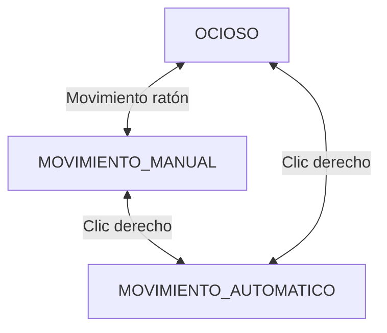

# Inteligencia Artificial para Videojuegos - Práctica 3: Disturbios orbitales

> [!NOTE]
> Versión: 1

## Índice
1. [Autores](#autores)
2. [Resumen](#resumen)
3. [Instalación y uso](#instalación-y-uso)
4. [Introducción](#introducción)
5. [Punto de partida](#punto-de-partida)
6. [Planteamiento del problema](#planteamiento-del-problema)
7. [Diseño de la solución](#diseño-de-la-solución)
8. [Implementación](#implementación)
9. [Pruebas y métricas](#pruebas-y-métricas)
10. [Ampliaciones](#ampliaciones)
11. [Conclusiones](#conclusiones)
12. [Licencia](#licencia)
13. [Referencias](#referencias)

## Autores
- Nieves Alonso Gilsanz [@nievesag](https://github.com/nievesag)
- Cynthia Tristán Álvarez [@cyntrist](https://github.com/cyntrist)

## Resumen
La práctica consiste en desarrollar un prototipo de IA para Videojuegos, dentro de un entorno virtual que representa una prisión espacial con varios prisioneros (todos enemigos mortales entre sí) más un grupo de vigilantes robóticos que tratan de poner orden. En este entorno nosotros tenemos que programar a un agente inteligente capaz de percibir, moverse, navegar y decidir, como uno más de los prisioneros, de modo que logre maximizar el número de enemigos abatidos y minimizar el número de ocasiones en que él mismo es eliminado.

## Instalación y uso
Todo el contenido del proyecto está disponible en este repositorio, con **Unity 6000.3.12f1** siendo capaces de bajar todos los paquetes necesarios y editar el proyecto. Para poder hacer pruebas de multijugador desde Unity: en el editor ir a Window > Multiplayer > Multiplayer Play Mode y marcar que se quiere al menos un virtual player (Player 2). Esto abre una segunda ventana de juego y al dar a Play se podrá jugar simultáneamente con las dos ventanas.

## Introducción
Este proyecto es una práctica de la asignatura de Inteligencia Artificial para Videojuegos del Grado en Desarrollo de Videojuegos de la UCM, cuyo enunciado original es este: [Disturbios Orbitales](https://narratech.com/es/inteligencia-artificial-para-videojuegos/navegacion/el-secreto-del-laberinto/).

Las prisiones espaciales funcionan como potentes metáforas sobre vigilancia extrema y deshumanización de los reclusos. En estos casos los disturbios pueden originarse por auténticas crisis de supervivencia que se dan en las órbitas de planetas perdidos y otros rincones olvidados del universo.

En torno a este tema vamos a desarrollar un prototipo centrado en modelar la toma de decisiones de distintos «prisioneros», que intervienen en disturbios armados que se producen en una prisión imaginaria ubicada en una de las lunas que orbitan en torno a Saturno.

Este prototipo sirve para poner en práctica una de las herramientas de toma de decisiones más populares de la industria: la máquina de estados, concretamente la máquina de estados jerárquica. Además se aprovechará la búsqueda de caminos mediante mallas de navegación y el movimiento mediante comportamientos de dirección y hasta algo de gestión sensorial, pero esta vez aprovechando todo lo posible las herramientas que Unity trae integradas.

## Punto de partida
Hemos partido de un proyecto base proporcionado por el profesor y disponible en este repositorio: [fps-online](https://github.com/narratech/fps-online).

La base consiste en un menú inicial en el que, para jugar, se debe establecer el Host de la partida, que será un jugador más, con: un nombre, una dirección IP, un puerto y el personaje que jugará. A la partida *hosteada* por este Host se le podrán unir otros jugadores, estableciendo también: un nombre, una dirección IP, un puerto y el personaje que jugará. En este menú también se podrán consultar los controles del juego.

Existe además un botón con el que iniciar el juego, que lleva al nivel de la cárcel espacial, un entorno 3D explorable donde irán apareciendo:
- Prisioneros. Aparecen de alguno de los puntos de regeneración, y pueden ser controlados por jugadores humano o virtuales (bots implementados con técnicas de IA). Pueden moverse, disparar, apuntar, cambiar de arma, saltar, agacharse, correr y hasta usar un propulsor (jetpack) para «volar».

- Armas. Sólo los prisioneros pueden cogerlas y utilizarlas, existiendo de varios tipos:
1. Pistola (gun), el arma que todos los prisioneros tienen por defecto.
2. Lanzamisiles (launcher), que en realidad lanza unos discos que explotan.
3. Fusil de francotirador (sniper), para largo alcance.
4. Lanzallamas (flamethower), interesante aunque no haya mecánicas de transmisión de fuego.
5. Rifle (rifle), arma más pesada pero más estable.
6. Dos pistola (guns), a falta de una.
7. Escopeta (shot gun), causa daño en un radio más ancho.

- Utensilios. Como botiquines para recuperar salud o el propulsor para poder «volar» con él.
- Vigilantes robóticos. Hay de dos tipos, las torretas (turrets) y los robots flotantes (hover bots). Las primeras son más poderosas pero permanecen ancladas en sus ubicaciones originales, mientras que los segundos son más débiles pero tienen movilidad. Todos los vigilantes robóticos disparan a los prisioneros y pueden matarlos. 

El avatar cuenta controles de movimiento con WASD. Y de disparo con clic izquierdo. También podrá cambiar de arma, en caso de tener varias, con la rueda del ratón.

#### Jerarquía de recursos
```text
Assets
├── FPS
│   ├── Animation
│   ├── Art
│   ├── Audio
│   ├── Prefabs
│   ├── Scenes
│   ├── Scripts
│   └── Tutorials
├── NavMeshComponents
├── Rendering
├── Resultados
├── TextMesh Pro 
├── ThirdPartyResources
└── UI Toolkit
```

### Estructura del proyecto
Dentro de FPS los recursos que conforman el proyecto están organizados de esta forma:
* **Animation**. Animaciones, character controllers, máscaras y rigs de todos los personajes que conforman el juego.
* **Art**. Fuentes, materiales, modelos, shaders y texturas.
* **Audio**. Efectos de sonido y música usada durante el juego.
* **Prefabs**. Los prefabricados que se usan en el juego, del avatar, los enemigos, la interfaz y las distintas partes del escenario. 
* **Scenes**. La escena inicial del menú, la escena de la cárcel y las escenas de victoria y derrota.
* **Scripts**. Todas las clases con el código organizadas en una jerarquía de carpetas.
  * **AI**.
  * **Editor**.
  * **Game**. 
  * **Gameplay**. 
  * **MiMultiplayer**.
  * **UI**.

### Estructura de las escenas


## Planteamiento del problema
**Las características principales del prototipo son:**
* **A.** Hay un mundo virtual (la prisión orbital) con un esquema de división de malla de navegación proporcionado por Unity, con las estancias y todos los elementos descritos anteriormente, distribuidos según una serie de puntos representativos del escenario (waypoints). Hay una cámara principal preparada para seguir al protagonista en primera persona desde el comienzo y otra cámara secundaria para tener una vista general de la escena.

* **B.** El agente que controlamos (prisionero) aparece en uno de los puntos representativos del escenario y puede moverse por el escenario con todas las acciones de movimiento descritas anteriormente.

* **C.** La navegación del agente aprovecha herramientas integradas en Unity, como la malla de navegación, siendo su comportamiento por defecto tratar de recorrer cautelosamente todas las estancias de la prisión buscando armas y otros prisioneros a los que atacar con ellas.

* **D.** Para la decisión del agente se usa la infraestructura de una máquina de estados finita jerárquica (aunque sin estados en paralelo) cuyos estados, transiciones y condiciones concretas se cargan desde un fichero de texto con una determinada sintaxis. La infraestructura es genérica y está programada íntegramente en C# para Unity.

* **E.** En conjunto el agente trata de maximizar la métrica principal del juego que es número de enemigos que he eliminado – número de veces que he sido eliminado, aunque opcionalmente también se podrían mostrar por pantalla otras métricas interesantes como número de armas conseguidas, número de utensilios conseguidos, número de vigilantes robóticos eliminados… todo ello con el contexto de la duración de la partida en segundos y el ratio de fotogramas por segundo, por ejemplo.

## Diseño de la solución

### Estados de los agentes

- **Torreta**:


Los scripts usados para cada agente de IA han sido:
* **Torreta**: 
    

## Implementación
**Tareas:**
Las tareas y el esfuerzo ha sido repartido de manera equitativa entre las autoras.

| Estado  |  Tarea  |  Fecha  |  
|:-:|:--|:-:|
|  |  |  |
|  | AMPLIACIONES |  |
|  |  |  |

**Diagrama de clases:**
Las clases principales que se han desarrollados son las siguientes:

Implementación: Se adjuntan los scripts con el código fuente que implementan las principales características. Los scripts están documentados para mayor claridad y detalle sobre su implementación.

| Característica del prototipo | Descripción de la característica | Script |
|:-:|:-:|:-:|
| A | Control del jugador | [ControlJugador](https://github.com/IAV26-G09/IAV26-G09-P2/blob/main/Assets/Scripts/Comportamientos/ControlJugador.cs) |
| B | Configuración creación minotauros | [MinoManager](https://github.com/IAV26-G09/IAV26-G09-P2/blob/main/Assets/Scripts/Comportamientos/MinoManager.cs) |
| B | Comportamiento vigías | [Vigilar](https://github.com/IAV26-G09/IAV26-G09-P2/blob/main/Assets/Scripts/Comportamientos/Vigilar.cs) |
| B | Campo de visión minotauros | [CampoVision](https://github.com/IAV26-G09/IAV26-G09-P2/blob/main/Assets/Scripts/Comportamientos/CampoVision.cs) |
| B | Seguimiento hacia el avatar | [Llegada](https://github.com/IAV26-G09/IAV26-G09-P2/blob/main/Assets/Scripts/Comportamientos/Llegada.cs) |
| B | Área de influencia | [Slow](https://github.com/IAV26-G09/IAV26-G09-P2/blob/main/Assets/Scripts/Comportamientos/Slow.cs) |
| C | A* | [Graph](https://github.com/IAV26-G09/IAV26-G09-P2/blob/main/Assets/Scripts/Graphs/Graph.cs) |
| C | A* costes dinámicos | [InfluenceCollision](https://github.com/IAV26-G09/IAV26-G09-P2/blob/main/Assets/Scripts/Comportamientos/InfluenceCollision.cs) |
| C | Mostrar hilo | [TheseusGraph](https://github.com/IAV26-G09/IAV26-G09-P2/blob/main/Assets/Scripts/Graphs/TheseusGraph.cs) |
| C | Mostrar ovillos | [Ovillo](https://github.com/IAV26-G09/IAV26-G09-P2/blob/main/Assets/Scripts/Extra/Ovillo.cs) |
| C | Heurísticas | [TheseusGraph](https://github.com/IAV26-G09/IAV26-G09-P2/blob/main/Assets/Scripts/Graphs/TheseusGraph.cs) |
| D | Suavizado | [Graph](https://github.com/IAV26-G09/IAV26-G09-P2/blob/main/Assets/Scripts/Graphs/Graph.cs) |
| E | Navegación automática | [SeguirCamino](https://github.com/IAV26-G09/IAV26-G09-P2/blob/main/Assets/Scripts/Comportamientos/SeguirCamino.cs) |

### Información básica
Los ficheros FSM.cs y BotGameplayActions.cs sobre los que hay que trabajar más para cambiarlos por completo y tener allí tanto la máquina de estados jerárquica (capaz de cargar datos de una FSM particular de un fichero de texto y ejecutarla después) como el gestor de acciones con el que CONCRETAMOS lo que se hace o consulta en cada estado o transición de la FSM.

*Human_Prefab* representa al jugador humano y *UCM_Bot* es la IA que hay que programar si se quiere tener un bot contra el que enfrentarse.

### Human_Prefab
Ruta: Assets/FPS/Scripts/MiMultiplayer/Human_Prefab.prefab

Es el “paquete completo” del jugador: control FPS, cámara, armas, vida/daño y los componentes oficiales de Netcode que permiten hacer multijugador en Unity.

Lo más relevante que puede encontrarse en la raíz de este prefab es esto:

* NetworkObject: identidad de red del jugador.
* PlayerInput (Input System): componente de Unity que gestiona dispositivos/mapas de entrada.
* NewMonoBehaviourScript (tu “ClientPlayerMove” real, el hombre es que no está bien puesto): habilita cámara/controles sólo para el propietario, crea el HUD del marcador, etc.
* PlayerRespawner: maneja muerte/respawn en red (RPC al server y respawn al cliente).
* ClientNetworkTransform: sincroniza transform (owner authority en tu setup).
* PlayerHealthSync: sincroniza vida/estado.
* PlayerVotingSync (solo en Human): sistema de votación/acciones especiales.
* PlayerNameTag: nombre/kills/deaths en red.
* ClientNetworkAnimator: Script para hacer animación sincronizada.
* Rigging / IK / Weapon sync: WeaponIKSync, ThirdPersonWeaponSync, RigBuilder, constraints, etc. Son scripts de sincronización (por ejemplo PlayerHealthSync, ThirdPersonWeaponSync, LocalVisibility...).
* UI (CanvasScaler, GraphicRaycaster, TMP): el canvas world-space del nametag y elementos.
* CharacterController: componente nativo de Unity para mover un “personaje tipo cápsula” en el mundo sin usar un Rigidbody. Gestiones colisiones, deslizamiento, movimiento 'cinemático', grounding básico... pero no hace nada más.
* PlayerCharacterController: Script de este proyecto que hace las veces de MENTE del CharacterController, lee la entrada con PlayerInputHandler, y lo convierte en movimiento, rotación, coordina la cámara, la animación, está pendiente de la salud, muerte, apuntado, etc. 

### UCM_Bot
Ruta: Assets/FPS/Scripts/MiMultiplayer/UCM_Bot.prefab

En UCM_Bot encontramos componentes muy parecidos, aunque se ha añadido FSM como ejemplo de dónde podría ir una máquina de estados que tome las decisiones de ese bot, y BotGameplayActions para hacer las veces de gestor de acciones.

## Pruebas y métricas
### Plan de pruebas

Serie corta y rápida posible de pruebas que pueden realizarse para verificar que se cumplen las características requeridas:

### Métricas tomadas
En un PC de estas características:
- **CPU:** AMD Ryzen 7 5700G a 3.80 GHz
- **GPU:** NVIDIA GeForce GTX 1660 SUPER 6 GB
- **RAM:** 16 GB (8x2) de 3200 MT/s
- **SO:** Windows 11
- **Versión de Unity:** 6000.0.66f2

Se han tomado las siguientes métricas:

### Vídeo
- [Vídeo demostración]()

## Ampliaciones
### Posibles realizadas
Se han pensado las siguientes posibles ampliaciones:

## Conclusiones


## Licencia
Nieves Alonso Gilsanz y Cynthia Tristán Álvarez, con el permiso de Federico Peinado, autores de la documentación, código y recursos de este trabajo, concedemos permiso permanente para utilizar este material, con sus comentarios y evaluaciones, con fines educativos o de investigación; ya sea para obtener datos agregados de forma anónima como para utilizarlo total o parcialmente reconociendo expresamente nuestra autoría. 

## Referencias
A continuación se detallan todas las referencias bibliográficas, lúdicas o de otro tipo utilizdas para realizar este prototipo. Los recursos de terceros que se han utilizados son de uso público[^1][^2][^3].

 el pseudocódigo de *Millington*[^4], referenciado ampliamente a lo largo del contenido del curso en Narratech[^5][^6][^7][^8][^9].

[^5]: Narratech [*Disturbios orbitales*](https://narratech.com/es/inteligencia-artificial-para-videojuegos/decision/disturbios-orbitales/)

[^6]: Narratech [*Representación del conocimiento*](https://narratech.com/es/inteligencia-artificial-para-videojuegos/decision/representacion-del-conocimiento/)

[^7]: Narratech [*Máquinas de estados*](https://narratech.com/es/inteligencia-artificial-para-videojuegos/decision/maquina-de-estados/)

[^8]: Narratech [*Reglas y planificación*](https://narratech.com/es/inteligencia-artificial-para-videojuegos/decision/arbol-de-comportamiento/)

[^9]: Narratech [*Probabilidad y utilidad*](https://narratech.com/es/inteligencia-artificial-para-videojuegos/decision/probabilidad-y-utilidad/)
