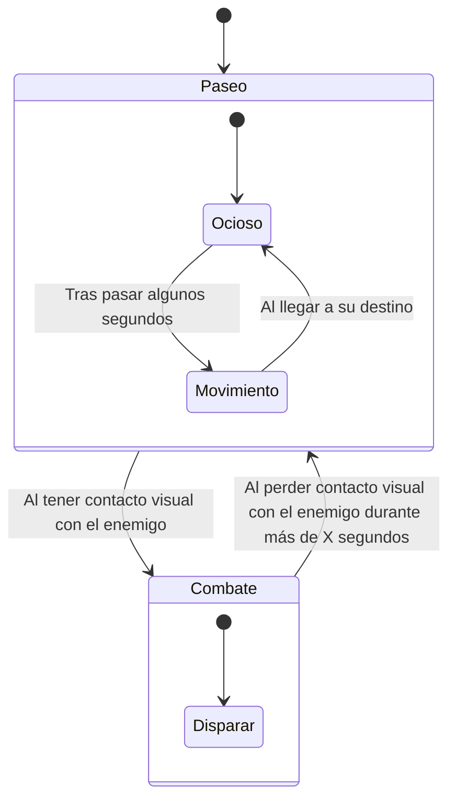
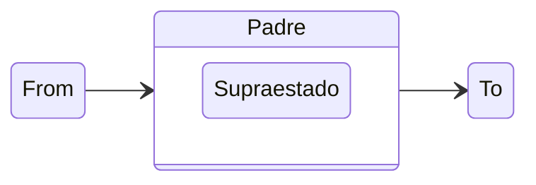
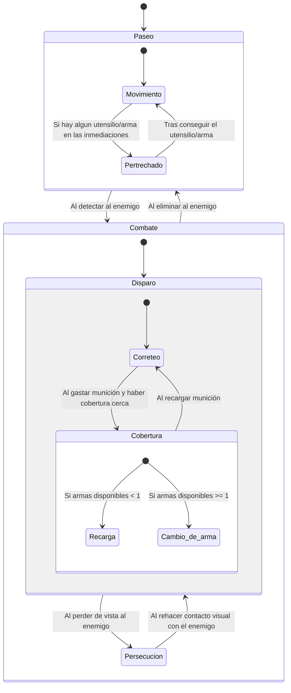
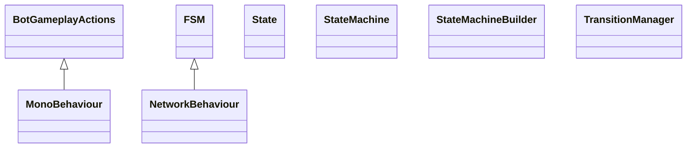

# Inteligencia Artificial para Videojuegos - Práctica 3: Disturbios orbitales

> [!NOTE]
> Versión: 1

## Índice
1. [Autores](#autores)
2. [Resumen](#resumen)
3. [Instalación y uso](#instalación-y-uso)
4. [Introducción](#introducción)
5. [Punto de partida](#punto-de-partida)
6. [Planteamiento del problema](#planteamiento-del-problema)
7. [Diseño de la solución](#diseño-de-la-solución)
8. [Implementación](#implementación)
9. [Pruebas y métricas](#pruebas-y-métricas)
10. [Ampliaciones](#ampliaciones)
11. [Conclusiones](#conclusiones)
12. [Licencia](#licencia)
13. [Referencias](#referencias)

## Autores
- Nieves Alonso Gilsanz [@nievesag](https://github.com/nievesag)
- Cynthia Tristán Álvarez [@cyntrist](https://github.com/cyntrist)

## Resumen
La práctica consiste en desarrollar un prototipo de IA para Videojuegos, dentro de un entorno virtual que representa una prisión espacial con varios prisioneros (todos enemigos mortales entre sí) más un grupo de vigilantes robóticos que tratan de poner orden. En este entorno nosotros tenemos que programar a un agente inteligente capaz de percibir, moverse, navegar y decidir, como uno más de los prisioneros, de modo que logre maximizar el número de enemigos abatidos y minimizar el número de ocasiones en que él mismo es eliminado.

## Instalación y uso
Todo el contenido del proyecto está disponible en este repositorio, con **Unity 6000.3.12f1** siendo capaces de bajar todos los paquetes necesarios y editar el proyecto. Para poder hacer pruebas de multijugador desde Unity: en el editor ir a Window > Multiplayer > Multiplayer Play Mode y marcar que se quiere al menos un virtual player (Player 2). Esto abre una segunda ventana de juego y al dar a Play se podrá jugar simultáneamente con las dos ventanas.

## Introducción
Este proyecto es una práctica de la asignatura de Inteligencia Artificial para Videojuegos del Grado en Desarrollo de Videojuegos de la UCM, cuyo enunciado original es este: [Disturbios Orbitales](https://narratech.com/es/inteligencia-artificial-para-videojuegos/navegacion/el-secreto-del-laberinto/).

Las prisiones espaciales funcionan como potentes metáforas sobre vigilancia extrema y deshumanización de los reclusos. En estos casos los disturbios pueden originarse por auténticas crisis de supervivencia que se dan en las órbitas de planetas perdidos y otros rincones olvidados del universo.

En torno a este tema vamos a desarrollar un prototipo centrado en modelar la toma de decisiones de distintos «prisioneros», que intervienen en disturbios armados que se producen en una prisión imaginaria ubicada en una de las lunas que orbitan en torno a Saturno.

Este prototipo sirve para poner en práctica una de las herramientas de toma de decisiones más populares de la industria: la máquina de estados, concretamente la máquina de estados jerárquica. Además se aprovechará la búsqueda de caminos mediante mallas de navegación y el movimiento mediante comportamientos de dirección y hasta algo de gestión sensorial, pero esta vez aprovechando todo lo posible las herramientas que Unity trae integradas.

## Punto de partida
Hemos partido de un proyecto base proporcionado por el profesor y disponible en este repositorio: [fps-online](https://github.com/narratech/fps-online).

La base consiste en un menú inicial en el que, para jugar, se debe establecer el Host de la partida con: un nombre, una dirección IP, un puerto y el personaje que jugará. A la partida *hosteada* por este Host se le podrán unir otros jugadores, estableciendo también: un nombre, una dirección IP, un puerto y el personaje que jugará. En este menú también se podrán consultar los controles del juego.

De los personajes jugables seleccionables, la implementación de la práctica se centra en la inteligencia artificial que controlará a *UCM_Bot*. Para pruebas de mecánicas de juego, no inteligencia artificial, se puede seleccionar al personaje *Human_Prefab*, que cuenta con los controles de teclado y mando especificados en la ventana de juego *Controls*. 

Existe además un botón con el que iniciar el juego, que lleva al nivel de la cárcel espacial, un entorno 3D explorable donde irán apareciendo:
- Prisioneros. Aparecen en alguno de los puntos de regeneración. Pueden moverse, disparar, apuntar, cambiar de arma, saltar, agacharse, correr y usar un propulsor (jetpack) para «volar». Cuando un jugador se une a una partida será un prisionero y sus movimientos podrán ser implementados mediante mecánicas de IA, en el caso de seleccionar al personaje *UCM_Bot*, o mediante teclado y ratón o mando, en el caso de seleccionar al personaje *Human_Prefab*.

- Armas. Sólo los prisioneros pueden cogerlas y utilizarlas, existiendo de varios tipos:
1. Pistola (gun), el arma que todos los prisioneros tienen por defecto.
2. Lanzamisiles (launcher), que en realidad lanza unos discos que explotan.
3. Fusil de francotirador (sniper), para largo alcance.
4. Lanzallamas (flamethower), interesante aunque no haya mecánicas de transmisión de fuego.
5. Rifle (rifle), arma más pesada pero más estable.
6. Dos pistola (guns), a falta de una.
7. Escopeta (shot gun), causa daño en un radio más ancho.

- Utensilios. Como botiquines para recuperar salud o el propulsor para poder «volar» con él.
- Vigilantes robóticos. Hay de dos tipos, las torretas (turrets) y los robots flotantes (hover bots). Las primeras son más poderosas pero permanecen ancladas en sus ubicaciones originales, mientras que los segundos son más débiles pero tienen movilidad. Todos los vigilantes robóticos disparan a los prisioneros y pueden matarlos. 

#### Jerarquía de recursos
```text
Assets
├── FPS
│   ├── Animation
│   ├── Art
│   ├── Audio
│   ├── Prefabs
│   ├── Scenes
│   ├── Scripts
│   │   ├── AI
│   │   ├── Editor
│   │   ├── Game
│   │   ├── Gameplay
│   │   ├── MiMultiplayer     
│   │   ├── **StateMachine**
│   │   └── UI
│   └── Tutorials
├── NavMeshComponents
├── Rendering
├── Resultados
├── TextMesh Pro 
├── ThirdPartyResources
└── UI Toolkit
```

El grueso de la implementación que concierne a esta práctica está situado en la carpeta **StateMachine**.

### Estructura del proyecto
Dentro de FPS los recursos que conforman el proyecto están organizados de esta forma:
* **Animation**. Animaciones, character controllers, máscaras y rigs de todos los personajes que conforman el juego.
* **Art**. Fuentes, materiales, modelos, shaders y texturas.
* **Audio**. Efectos de sonido y música usada durante el juego.
* **Prefabs**. Los prefabricados que se usan en el juego, del avatar, los enemigos, la interfaz y las distintas partes del escenario. 
* **Scenes**. La escena inicial del menú, la escena de la cárcel, las escenas de victoria y derrota, etc. Así como los NavMesh .asset de los distintos escenarios.
* **Scripts**. Todas las clases con el código del proyecto base organizadas en una jerarquía de carpetas.
* **StateMachine**. Todas las clases con el código de la implementación de la práctica 3 "Disturbios orbitales" para la asignatura de Inteligencia Artificial para Videojuegos, usadas para la gestión de la máquina de estados de los agentes *UCM_Bot* y de sus acciones.
* **Tutorials**. Recursos utilizados para la gestión del tutorial del proyecto base.

### Estructura de las escenas
Para la implementación del proyecto son relevantes dos escenas:
* IntroMenu: Se muestra un botón para jugar y un botón para visualizar los controles. Al darle al botón de jugar se pasa primero por una configuración de partida donde se debe establecer el Host de la partida con: un nombre, una dirección IP, un puerto y el personaje que jugará. A la partida *hosteada* por este Host se le podrán unir otros jugadores, estableciendo también: un nombre, una dirección IP, un puerto y el personaje que jugará. En este menú también se podrán consultar los controles del juego.

* PrisonScene: El mundo virtual con obstáculos, enemigos y puntos de regeneración de personajes y objetos, con su respectiva NavMesh para su correcta navegación.

## Planteamiento del problema
**Las características principales del prototipo son:**
* **A.** Hay un mundo virtual (la prisión orbital) con un esquema de división de malla de navegación proporcionado por Unity, con las estancias y todos los elementos descritos anteriormente, distribuidos según una serie de puntos representativos del escenario (waypoints). Hay una cámara principal preparada para seguir al protagonista en primera persona desde el comienzo y otra cámara secundaria para tener una vista general de la escena.

* **B.** El agente que controlamos (prisionero) aparece en uno de los puntos representativos del escenario y puede moverse por el escenario con todas las acciones de movimiento descritas anteriormente.

* **C.** La navegación del agente aprovecha herramientas integradas en Unity, como la malla de navegación, siendo su comportamiento por defecto tratar de recorrer cautelosamente todas las estancias de la prisión buscando armas y otros prisioneros a los que atacar con ellas.

* **D.** Para la decisión del agente se usa la infraestructura de una máquina de estados finita jerárquica (aunque sin estados en paralelo) cuyos estados, transiciones y condiciones concretas se cargan desde un fichero de texto con una determinada sintaxis. La infraestructura es genérica y está programada íntegramente en C# para Unity.

* **E.** En conjunto el agente trata de maximizar la métrica principal del juego que es número de enemigos que he eliminado – número de veces que he sido eliminado, aunque opcionalmente también se podrían mostrar por pantalla otras métricas interesantes como número de armas conseguidas, número de utensilios conseguidos, número de vigilantes robóticos eliminados… todo ello con el contexto de la duración de la partida en segundos y el ratio de fotogramas por segundo, por ejemplo.

## Diseño de la solución
### Diseño de la implementación de la máquina de estados
Los scripts usados para la gestión de estados del agente:
* BotGameplayActions
* FSM
* State
* StateMachine
* States
* TransitionManager

Para la implementación de la máquina de estados se ha visualizado esta como un **árbol** de tal forma que un diagrama de estados se podría desplegar de esta forma:
#### Diagrama de ejemplo

#### Diagrama de ejemplo, desplegado

La máquina de estados, [*StateMachine*](https://github.com/IAV26-G09/IAV26-G09-P3/blob/main/Assets/FPS/Scripts/StateMachine/StateMachine.cs), almacena una referencia al nodo raíz del árbol, será el primer nodo al que se entre al iniciar la máquina y con ello el *mecanismo* empieza a funcionar. La gestión de la ejecución de esta se delega en la clase [*FSM*](https://github.com/IAV26-G09/IAV26-G09-P3/blob/main/Assets/FPS/Scripts/StateMachine/FSM.cs) la cual se hace responsable de llamar al método *Tick(deltaTime)* de la *StateMachine*.

Cada nodo en el árbol máquina de estados es entonces un estado, [*State*](https://github.com/IAV26-G09/IAV26-G09-P3/blob/main/Assets/FPS/Scripts/StateMachine/State.cs), con los métodos básicos:
* *OnEnter()*: Método que se ejecuta al entrar al estado.
* *OnExit()*: Método que se ejecuta al salir del estado.
* *OnUpdate()*: Método que se ejecuta en cada *tick* si el estado está activo.
* *GetTransition()*: Método que se usa para definir si un estado quiere transicionar, si quiere hacerlo devuelve el estado al que quiere ir y si no devuelve nulo.
Al ser una máquina de estados jerárquica los estados podrán contener otros estados, que a su vez podrán contener otros estados, y así indefinidamente, para gestionar esto se puede establecer: Un **estado hijo inicial** por defecto, al que se entrará cuando se entre en el estado padre, bajando un nivel en el árbol, por lo que, por ejemplo, al entrar al estado raíz se entra al estado hijo inicial H* (si el estado hijo inicial es nulo significa que estamos en una hoja del árbol) y un **estado hijo activo** a actualizar en cada update de manera recursiva tal que cada estado se actualice a sí mismo y llame a actualizar a su hijo activo, que hará lo mismo.

Para gestionar las transiciones se hace uso de un [*TransitionsManager*](https://github.com/IAV26-G09/IAV26-G09-P3/blob/main/Assets/FPS/Scripts/StateMachine/TransitionManager.cs) el cual triggerea las transiciones pidiendo cambiar de estado a la máquina de estados. Si una transición va a tener efecto entre dos estados se busca el nodo padre de mayor profundidad común a ambos y se procede a: 1. Salir de todos los estados desde el estado destino hasta el nodo padre calculado y 2. Ir entrando en todos los nodos desde el nodo padre calculado y hasta el estado destino.


Para las acciones y condiciones concretas se hace uso de la clase [*BotGameplayActions*](https://github.com/IAV26-G09/IAV26-G09-P3/blob/main/Assets/FPS/Scripts/StateMachine/BotGameplayActions.cs) la cual centraliza métodos como *HasReachedCurrentDestination()* o *TryMoveToWorldPosition()* para que los estados puedan usarlos para definir comportamientos en su *OnUpdate()* o condiciones para transicionar a otro estado en su *GetTransition()*.

### Diseño de los estados del bot prisionero
Se ha propuesto el siguiente diseño de máquina de estados para los comportamientos del bot prisionero, con el objetivo de maximizar la métrica principal del juego (número de enemigos que he eliminado – número de veces que he sido eliminado).



## Implementación
**Tareas:**
Las tareas y el esfuerzo ha sido repartido de manera equitativa entre las autoras.

| Estado  |  Tarea  |  Fecha  |  
|:-:|:--|:-:|
| ✔ | Organización del proyecto | 15-4-2026 |
| ✔ | Máquina de estados base | 18-4-2026 |
| ✔ | Manager de transiciones de estados | 18-4-2026 |
| ✔ | Máquina de estados enlazada con FSM | 18-4-2026 |
| ✔ | FSM enlazada con BotGameplayActions | 19-4-2026 |
| ✔ | Cámara top down | 19-4-2026 |
| ✔ | Organización del proyecto | 15-4-2026 |
| ✔ | README | 23-4-2026 |

**Diagrama de clases:**
Las clases principales que se han desarrollados son las siguientes:


Implementación: Se adjuntan los scripts con el código fuente que implementan las principales características. Los scripts están documentados para mayor claridad y detalle sobre su implementación.

| Característica del prototipo | Descripción de la característica | Script |
|:-:|:-:|:-:|
| A | Cámaras | [GameFlowManager](https://github.com/IAV26-G09/IAV26-G09-P3/blob/main/Assets/FPS/Scripts/Game/Managers/GameFlowManager.cs) |
| B | Acciones del agente | [BotGameplayActions](https://github.com/IAV26-G09/IAV26-G09-P3/blob/main/Assets/FPS/Scripts/StateMachine/BotGameplayActions.cs) |
| D | Máquina de estados finita jerárquica | [FSM](https://github.com/IAV26-G09/IAV26-G09-P3/blob/main/Assets/FPS/Scripts/StateMachine/FSM.cs) |
| D | Máquina de estados finita jerárquica | [State](https://github.com/IAV26-G09/IAV26-G09-P3/blob/main/Assets/FPS/Scripts/StateMachine/State.cs) |
| D | Máquina de estados finita jerárquica | [StateMachine](https://github.com/IAV26-G09/IAV26-G09-P3/blob/main/Assets/FPS/Scripts/StateMachine/StateMachine.cs) |
| D | Máquina de estados finita jerárquica | [TransitionManager](https://github.com/IAV26-G09/IAV26-G09-P3/blob/main/Assets/FPS/Scripts/StateMachine/TransitionManager.cs) |

Detallamos a continuación la información sobre las clases y prefabs más relevantes:

| Nuevas respecto a la plantilla | De la plantilla modificadas |  
|:-:|:-:|
| 🟣​​ | 🟡​ |

### Clases

#### [BotGameplayActions](https://github.com/IAV26-G09/IAV26-G09-P3/blob/main/Assets/FPS/Scripts/StateMachine/BotGameplayActions.cs) 🟡
Gestor de acciones.

#### [FSM](https://github.com/IAV26-G09/IAV26-G09-P3/blob/main/Assets/FPS/Scripts/StateMachine/FSM.cs) 🟡
Gestor de máquina de estados.

#### [StateMachine](https://github.com/IAV26-G09/IAV26-G09-P3/blob/main/Assets/FPS/Scripts/StateMachine/StateMachine.cs) 🟣

#### [TransitionManager](https://github.com/IAV26-G09/IAV26-G09-P3/blob/main/Assets/FPS/Scripts/StateMachine/TransitionManager.cs) 🟣

### ScriptableObjects

#### [State](https://github.com/IAV26-G09/IAV26-G09-P3/blob/main/Assets/FPS/Scripts/StateMachine/State.cs) 🟣

### Prefabs
*Human_Prefab* representa al jugador humano y *UCM_Bot* es la IA que hay que programar si se quiere tener un bot contra el que enfrentarse.

#### Human_Prefab
Es el "paquete completo" del jugador: control FPS, cámara, armas, vida/daño y los componentes oficiales de Netcode que permiten hacer multijugador en Unity. Lo más relevante que puede encontrarse en la raíz de este prefab es:
* NetworkObject: identidad de red del jugador.
* PlayerInput (Input System): componente de Unity que gestiona dispositivos/mapas de entrada.
* NewMonoBehaviourScript (tu “ClientPlayerMove” real, el hombre es que no está bien puesto): habilita cámara/controles sólo para el propietario, crea el HUD del marcador, etc.
* PlayerRespawner: maneja muerte/respawn en red (RPC al server y respawn al cliente).
* ClientNetworkTransform: sincroniza transform (owner authority en tu setup).
* PlayerHealthSync: sincroniza vida/estado.
* PlayerVotingSync (solo en Human): sistema de votación/acciones especiales.
* PlayerNameTag: nombre/kills/deaths en red.
* ClientNetworkAnimator: Script para hacer animación sincronizada.
* Rigging / IK / Weapon sync: WeaponIKSync, ThirdPersonWeaponSync, RigBuilder, constraints, etc. Son scripts de sincronización (por ejemplo PlayerHealthSync, ThirdPersonWeaponSync, LocalVisibility...).
* UI (CanvasScaler, GraphicRaycaster, TMP): el canvas world-space del nametag y elementos.
* CharacterController: componente nativo de Unity para mover un “personaje tipo cápsula” en el mundo sin usar un Rigidbody. Gestiones colisiones, deslizamiento, movimiento 'cinemático', grounding básico.
* PlayerCharacterController: Script de este proyecto que hace las veces de MENTE del CharacterController, lee la entrada con PlayerInputHandler, y lo convierte en movimiento, rotación, coordina la cámara, la animación, está pendiente de la salud, muerte, apuntado, etc.

#### UCM_Bot
En UCM_Bot encontramos componentes muy parecidos, aunque se ha añadido FSM como gestor de máquina de estados y BotGameplayActions como gestor de acciones, aunque también hace cosas como crear el componente NavMeshAgent en caso de que no lo tenga.

## Pruebas y métricas
### Plan de pruebas

Serie corta y rápida posible de pruebas a nivel offline y local que pueden realizarse para verificar que se cumplen las características requeridas:

* **1 (A).** Iniciar el juego, seleccionar la opción de *Play* y a continuación *Host*. Viene configurado previamente para hacer pruebas ya que los campos no necesitan valores estrictamente funcionales para iniciar partida, pero en caso de que no fuese así:
      * Rellenar los campos, en el de Nickname cualquier nombre, en el de IP Adress configurar su IP local privada, en puerto el valor 0000 y en personaje seleccionar UCM_Bot. Seleccionar *"START GAME"*.
* **2 (A).** Observar a través de tanto la vista del agente como alternando con el botón N a la visión de planta del nivel el mundo virtual las diferentes cámaras y el mundo virtual descrito.
* **3 (B).** Observar a través del comportamiento del agente las acciones que puede realizar, dónde ha sido generado y dónde se genera tras morir.
* **4 (C).** Observar el movimiento del agente a lo largo del nivel y su reaccion ante enemigos.
* **5 (D).** Observar los cambios de estado del agente ante sus distintas circunstancias, como al percibir a un enemigo, eliminarlo y volver a la patrulla.
* **6 (E).** Observar en la interfaz de usuario las distintas métricas tomadas en tiempo real sobre las estadísticas del agente.
* **7 (A, B, C, D, E).** Pulsar tecla Escape y volver a inicar la observación desde el paso 1.

Las métricas que se tomarán serán:
- Ratio de enemigos eliminados/veces que el bot ha sido eliminado
- Número de armas conseguidas
- Número de objetos conseguidos
- Duración de una partida hasta ser eliminado en segundos
- Ratio de fotogramas por segundo

<!--
### Métricas tomadas
En un PC de estas características:
- **CPU:** AMD Ryzen 7 5700G a 3.80 GHz
- **GPU:** NVIDIA GeForce GTX 1660 SUPER 6 GB
- **RAM:** 16 GB (8x2) de 3200 MT/s
- **SO:** Windows 11
- **Versión de Unity:** 6000.0.66f2

Se han tomado las siguientes métricas:
-->

### Vídeo
- Próximamente
<!-- - [Vídeo demostración]() -->


## Ampliaciones
Se han pensado las siguientes posibles ampliaciones: 
- Sistema de enfrentamiento de dos o más bots entre si de distintos tipos de IA cada uno.
- Ampliaciones en la complejidad de la percepción:
      - Sistema de audición
      - Memoria 

## Conclusiones
Para esta práctica se ha diseñado e implementado una máquina de estados jerárquica finita aplicada a la inteligencia artificial de bots que simulan las acciones de un jugador humano en un juego de disparos en primera persona, separando la toma de decisiones de la ejecución de acciones.

El principal resultado obtenido ha sido comprobar que una HFSM permite estructurar comportamientos complejos de forma escalable. La jerarquía de estados facilita reutilizar lógica y evita duplicación de código frente a FSM planas.

También se ha validado la importancia de la separación de responsabilidades: la máquina de estados gestiona sus transiciones, que son decididas por sus estados y estos mismos a su vez deciden lo que hacen, pero el cómo lo hacen se delega al gestor de acciones externo, en este caso BotGameplayActions. Esta separación mejora la mantenibilidad y permite modificar la lógica de juego sin afectar a la IA, y viceversa.

En conjunto, la práctica demuestra cómo una máquina de estaso jerárquica bien estructurada es una herramienta potente, ampliable y flexible para el desarrollo de IA en videojuegos.

## Licencia
Nieves Alonso Gilsanz y Cynthia Tristán Álvarez, con el permiso de Federico Peinado, autores de la documentación, código y recursos de este trabajo, concedemos permiso permanente para utilizar este material, con sus comentarios y evaluaciones, con fines educativos o de investigación; ya sea para obtener datos agregados de forma anónima como para utilizarlo total o parcialmente reconociendo expresamente nuestra autoría. 

## Referencias
A continuación se detallan todas las referencias bibliográficas, lúdicas o de otro tipo utilizdas para realizar este prototipo. Los recursos de terceros que se han utilizados son de uso público.

El punto de partida del proyecto parte de la plantilla pública de Unity "FPS Microgame"[^1]. 

El primer contacto para entender los conceptos principales del grueso del proyecto ha sido el pseudocódigo de *Millington*[^4], referenciado ampliamente a lo largo del contenido del curso en Narratech[^2][^3][^4][^5][^6], además del curso introductorio de Unity para máquinas de estados finitas[^7].

A la hora de implementar la máquina de estados finita jerárquica se ha hecho uso de repositorios de referencia para Unity públicos, como el de *Inspiaaa* con su librería de HFSM para Unity[^8] y especialmente el de *git-amend*[^9], que a su vez tomaba apunte de *Matt King*[^10] y *CrashKonijn*[^11].

Se planea realizar la serialización de los estados a través de entender la implementación de para JSON de *Ryan Kurte*[^12].

[^1]: Unity, [*FPS Microgame*](https://learn.unity.com/course/microgames-learn-the-basics-of-unity/unit/fps-template).

[^2]: Narratech, [*Disturbios orbitales*](https://narratech.com/es/inteligencia-artificial-para-videojuegos/decision/disturbios-orbitales/).

[^3]: Narratech, [*Representación del conocimiento*](https://narratech.com/es/inteligencia-artificial-para-videojuegos/decision/representacion-del-conocimiento/).

[^5]: Narratech, [*Máquinas de estados*](https://narratech.com/es/inteligencia-artificial-para-videojuegos/decision/maquina-de-estados/).

[^6]: Narratech, [*Reglas y planificación*](https://narratech.com/es/inteligencia-artificial-para-videojuegos/decision/arbol-de-comportamiento/).

[^7]: Narratech, [*Probabilidad y utilidad*](https://narratech.com/es/inteligencia-artificial-para-videojuegos/decision/probabilidad-y-utilidad/).

[^8]: Unity, [*Finite State Machines*](https://learn.unity.com/project/finite-state-machines-1).

[^8]: Inspiaaa, [*UnityHFSM*](https://github.com/Inspiaaa/UnityHFSM).

[^9]: git-amend, [*Unity Hierarchical StateMachine*](https://github.com/adammyhre/Unity-Hierarchical-StateMachine)

[^10]: Matt King, [*ca.tekly.treestate*](https://github.com/matt-tekly/tekly-packages/tree/main/Packages/ca.tekly.treestate)

[^11]: CrashKonijn, [*GOAP*](https://github.com/crashkonijn/GOAP)

[^12]: Ryan Kurte, [*JFSM*](https://github.com/ryankurte/jfsm)
