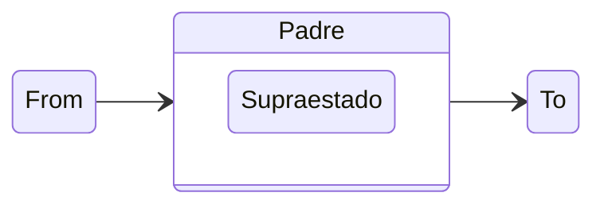
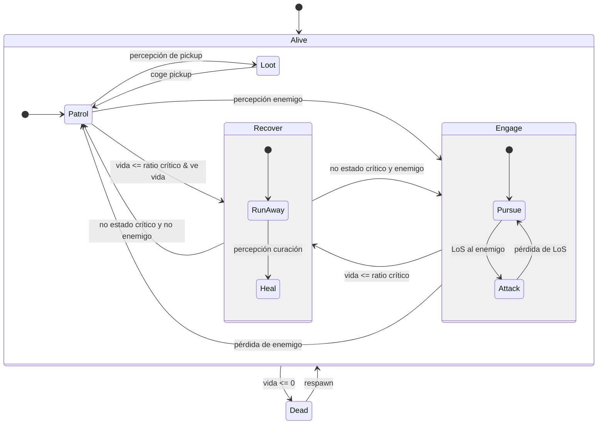
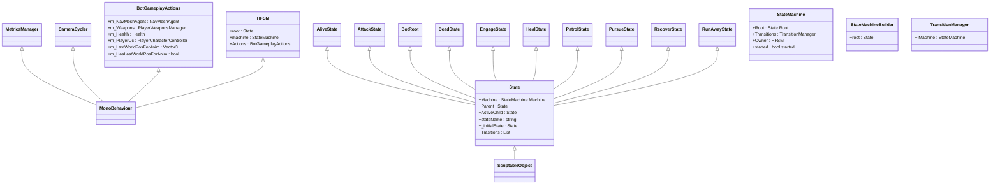
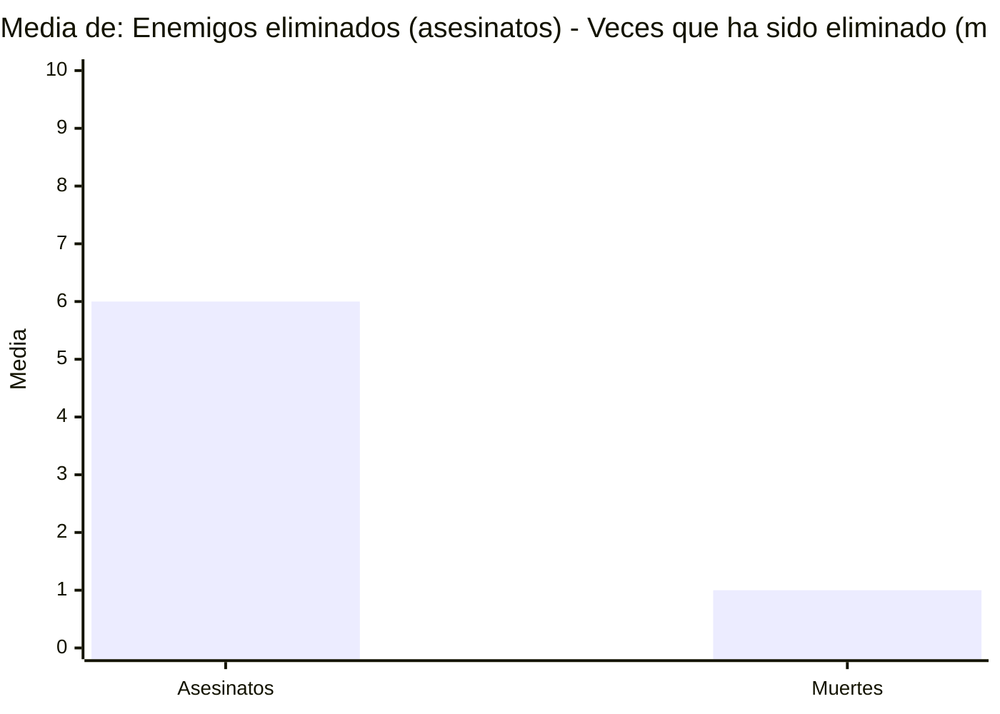

# Inteligencia Artificial para Videojuegos - Práctica 3: Disturbios orbitales

> [!NOTE]
> Versión: 2

> [!NOTE]
> Changelog: 
- [Instalación y uso](#instalación-y-uso), [Punto de partida](#punto-de-partida), [Planteamiento del problema](#planteamiento-del-problema)
  - Actualizados según el cambio del enunciado.
- [Diseño de la solución](#diseño-de-la-solución)
  - Ampliada y clarificada la explicación sobre el diseño de la solución.
- [Pruebas y métricas](#pruebas-y-métricas)
  - Rellenada sección de métricas y vídeo.

## Índice
1. [Autores](#autores)
2. [Resumen](#resumen)
3. [Instalación y uso](#instalación-y-uso)
4. [Introducción](#introducción)
5. [Punto de partida](#punto-de-partida)
6. [Planteamiento del problema](#planteamiento-del-problema)
7. [Diseño de la solución](#diseño-de-la-solución)
8. [Implementación](#implementación)
9. [Pruebas y métricas](#pruebas-y-métricas)
10. [Ampliaciones](#ampliaciones)
11. [Conclusiones](#conclusiones)
12. [Licencia](#licencia)
13. [Referencias](#referencias)

## Autores
- Nieves Alonso Gilsanz [@nievesag](https://github.com/nievesag)
- Cynthia Tristán Álvarez [@cyntrist](https://github.com/cyntrist)

## Resumen
La práctica consiste en desarrollar un prototipo de IA para Videojuegos, dentro de un entorno virtual que representa una prisión espacial con varios prisioneros (todos enemigos mortales entre sí) más un grupo de vigilantes robóticos que tratan de poner orden. En este entorno nosotros tenemos que programar a un agente inteligente capaz de percibir, moverse, navegar y decidir, como uno más de los prisioneros, de modo que logre maximizar el número de enemigos abatidos y minimizar el número de ocasiones en que él mismo es eliminado.

## Instalación y uso
Todo el contenido del proyecto está disponible en este repositorio, con **Unity 6000.0.66f2** siendo capaces de bajar todos los paquetes necesarios y editar el proyecto.

## Introducción
Este proyecto es una práctica de la asignatura de Inteligencia Artificial para Videojuegos del Grado en Desarrollo de Videojuegos de la UCM, cuyo enunciado original es este: [Disturbios Orbitales](https://narratech.com/es/inteligencia-artificial-para-videojuegos/navegacion/el-secreto-del-laberinto/).

Las prisiones espaciales funcionan como potentes metáforas sobre vigilancia extrema y deshumanización de los reclusos. En estos casos los disturbios pueden originarse por auténticas crisis de supervivencia que se dan en las órbitas de planetas perdidos y otros rincones olvidados del universo.

En torno a este tema vamos a desarrollar un prototipo centrado en modelar la toma de decisiones de distintos «prisioneros», que intervienen en disturbios armados que se producen en una prisión imaginaria ubicada en una de las lunas que orbitan en torno a Saturno.

Este prototipo sirve para poner en práctica una de las herramientas de toma de decisiones más populares de la industria: la máquina de estados, concretamente la máquina de estados jerárquica. Además se aprovechará la búsqueda de caminos mediante mallas de navegación y el movimiento mediante comportamientos de dirección y hasta algo de gestión sensorial, pero esta vez aprovechando todo lo posible las herramientas que Unity trae integradas.

## Punto de partida
Hemos partido de un proyecto base proporcionado por el profesor y disponible en este repositorio: [fps](https://github.com/narratech/fps).

La base consiste en un menú inicial desde el que se puede iniciar la simulación y consultar los controles del juego.

La implementación de la práctica se centra en el desarrollo de la inteligencia artificial que controlará a *Player* en la escena. 

Al clicar al botón *Play* en la escena *IntroMenu*, con el que iniciará el juego, se va a la escena *MainScene*, el nivel de la cárcel espacial, un entorno 3D explorable donde irán apareciendo:
- Prisioneros. Aparecen en alguno de los puntos de regeneración. Pueden moverse, disparar, apuntar, cambiar de arma y correr. Sus movimientos podrán ser implementados mediante mecánicas de IA.

- Recogibles. Sólo los prisioneros pueden cogerlos o utilizarlos:
1. Escopeta (shot gun), causa daño en un radio más ancho.
2. Botiquines, para recuperar salud.

- Vigilantes robóticos. Hay de dos tipos, las torretas (Turrets) y los robots flotantes (HoverBots). Las primeras son más poderosas pero permanecen ancladas en sus ubicaciones originales, mientras que los segundos son más débiles pero tienen movilidad. Todos los vigilantes robóticos disparan a los prisioneros y pueden matarlos. 

#### Jerarquía de recursos
```text
Assets
├── FPS
│   ├── Animation
│   ├── Art
│   ├── Audio
│   ├── Prefabs
│   ├── Scenes
│   ├── Scripts
│   │   ├── AI
│   │   ├── Game
│   │   ├── Gameplay 
│   │   ├── **StateMachine**
│   │   └── UI
│   └── Tutorials
├── ModAssets
├── NavMeshComponents
├── Rendering
└── TextMesh Pro
```

El grueso de la implementación que concierne a esta práctica está situado en la carpeta **StateMachine**.

### Estructura del proyecto
Dentro de FPS los recursos que conforman el proyecto están organizados de esta forma:
* **Animation**. Animaciones, character controllers, máscaras y rigs de todos los personajes que conforman el juego.
* **Art**. Fuentes, materiales, modelos, shaders y texturas.
* **Audio**. Efectos de sonido y música usada durante el juego.
* **Prefabs**. Los prefabricados que se usan en el juego, del avatar, los enemigos, la interfaz y las distintas partes del escenario. 
* **Scenes**. La escena inicial del menú, la escena de la cárcel, las escenas de victoria y derrota, etc. Así como los NavMesh .asset de los distintos escenarios.
* **Scripts**. Todas las clases con el código del proyecto base organizadas en una jerarquía de carpetas.
* **StateMachine**. Todas las clases con el código de la implementación de la práctica 3 "Disturbios orbitales" para la asignatura de Inteligencia Artificial para Videojuegos, usadas para la gestión de la máquina de estados de los agentes y de sus acciones.
* **Tutorials**. Recursos utilizados para la gestión del tutorial del proyecto base.

### Estructura de las escenas
Para la implementación del proyecto son relevantes dos escenas:
* IntroMenu: Se muestra un botón para jugar y un botón para visualizar los controles.
* MainScene: El mundo virtual con obstáculos, enemigos y puntos de regeneración de personajes y objetos, con su respectiva NavMesh para su correcta navegación.

## Planteamiento del problema
**Las características principales del prototipo son:**

* **A.** Hay un mundo virtual (la prisión orbital) con un esquema de división de malla de navegación proporcionado por Unity, con las estancias y todos los elementos descritos anteriormente, distribuidos según una serie de puntos representativos del escenario (waypoints). Hay una cámara principal preparada para seguir al protagonista en primera persona desde el comienzo y otra cámara secundaria para tener una vista general de la escena.

* **B.** El agente que controlamos (prisionero) aparece en uno de los puntos representativos del escenario y puede moverse por el escenario con algunas acciones de movimiento descritas anteriormente (al menos moverse, encarar hacia el objetivo y disparar).

* **C.** La navegación del agente aprovecha herramientas integradas en Unity, como la malla de navegación, siendo su comportamiento por defecto tratar de recorrer cautelosamente todas las estancias de la prisión buscando objetos (al menos armas y otros prisioneros a los que atacar con ellas).

* **D.** Para la decisión del agente se usa la infraestructura de una máquina de estados finita jerárquica (aunque sin poder ejecutar estados en paralelo) cuyos estados, transiciones y condiciones concretas (es decir, los datos) se cargan desde un fichero externo (ej. ScriptableObject o cualquier otro formato). La infraestructura es genérica y está programada íntegramente en C# para Unity.

* **E.** En conjunto el agente trata de maximizar la métrica principal del juego que es número de enemigos que he eliminado – número de veces que he sido eliminado, aunque opcionalmente también se podrían mostrar por pantalla otras métricas interesantes como número de armas conseguidas, número de utensilios conseguidos, número de vigilantes robóticos eliminados… todo ello con el contexto de una partida 1 contra 1, que dura X segundos y mantiene un ratio estable de Y fotogramas por segundo.

## Diseño de la solución
### Diseño de la implementación de la máquina de estados
Los scripts usados para la gestión de estados del agente:
* BotGameplayActions
* HFSM
* State
* StateMachine
* TransitionManager

Para la implementación de la máquina de estados se ha visualizado e implementado esta como un **árbol** de tal forma que un diagrama de estados como el usado de ejemplo en la lección sobre máquinas de estados en el curso de Narratech[^5] se podría desplegar de esta forma:

> [!IMPORTANT]
> Todas las máquinas de estados de ejemplo mostradas antes del apartado [Diseño de los estados del bot prisionero](##Diseño-de-los-estados-del-bot-prisionero) sirven como apoyo para ejemplificar la implementación de la HFSM y en ningún caso como solución de diseño propuesta para los comportamientos del agente *Bot Prisionero*.


> *A la izquierda, el diagrama de ejemplo, a la derecha, el diagrama de ejemplo desplegado en un árbol, tal como se trata en la implementación.*

La máquina de estados, [*StateMachine*](https://github.com/IAV26-G09/IAV26-G09-P3/blob/main/Assets/FPS/Scripts/StateMachine/StateMachine.cs), almacena una referencia al nodo raíz del árbol, será el primer nodo al que se entre al iniciar la máquina y con ello el *mecanismo* empieza a funcionar. La gestión de la ejecución de esta se delega en la clase [*HFSM*](https://github.com/IAV26-G09/IAV26-G09-P3/blob/main/Assets/FPS/Scripts/StateMachine/HFSM.cs) la cual se hace responsable de llamar al método *Tick(deltaTime)* de la *StateMachine*.

Cada nodo en el árbol máquina de estados es entonces un estado, [*State*](https://github.com/IAV26-G09/IAV26-G09-P3/blob/main/Assets/FPS/Scripts/StateMachine/State.cs), con los métodos básicos:
* *OnEnter()*: Método que se ejecuta al entrar al estado.
* *OnExit()*: Método que se ejecuta al salir del estado.
* *OnUpdate()*: Método que se ejecuta en cada *tick* si el estado está activo.
* *GetTransition()*: Método que se usa para definir si un estado quiere transicionar, si quiere hacerlo devuelve el estado al que quiere ir y si no devuelve nulo.

Al ser una máquina de estados jerárquica los estados podrán contener otros estados, que a su vez podrán contener otros estados, y así indefinidamente, para gestionar esto se puede establecer: Un **estado hijo inicial** por defecto, al que se entrará cuando se entre en el estado padre, bajando un nivel en el árbol, por lo que, por ejemplo, al entrar al estado raíz se entra al estado hijo inicial H* (si el estado hijo inicial es nulo significa que estamos en una hoja del árbol) y un **estado hijo activo** a actualizar en cada update de manera recursiva tal que cada estado se actualice a sí mismo y llame a actualizar a su hijo activo, que hará lo mismo.

Para gestionar las transiciones se hace uso de un [*TransitionsManager*](https://github.com/IAV26-G09/IAV26-G09-P3/blob/main/Assets/FPS/Scripts/StateMachine/TransitionManager.cs) el cual triggerea las transiciones pidiendo cambiar de estado a la máquina de estados. Si una transición va a tener efecto entre dos estados se busca el nodo padre de mayor profundidad común a ambos y se procede a: 1. Salir de todos los estados desde el estado destino hasta el nodo padre calculado y 2. Ir entrando en todos los nodos desde el nodo padre calculado y hasta el estado destino.


```mermaid
stateDiagram
     direction LR
     state Padre {
      Supraestado
     }
      From --> Padre
      Padre --> To
```

Lo visualizamos en la máquina de estados desplegada anteriormente: 


> *Pongamos que estando en el estado **Search** nos quedamos sin batería y debemos ir al estado **GetPower**.*

Para las acciones y condiciones concretas se hace uso de la clase [*BotGameplayActions*](https://github.com/IAV26-G09/IAV26-G09-P3/blob/main/Assets/FPS/Scripts/StateMachine/BotGameplayActions.cs) la cual centraliza métodos como *HasReachedCurrentDestination()* o *TryMoveToWorldPosition()* para que los estados puedan usarlos para definir comportamientos en su *OnUpdate()* o condiciones para transicionar a otro estado en su *GetTransition()*.

### Diseño de los estados del bot prisionero
Se ha propuesto el siguiente diseño de máquina de estados para los comportamientos del bot prisionero, con el objetivo de maximizar la métrica principal del juego (número de enemigos que he eliminado – número de veces que he sido eliminado).

```text
BotRoot
  ├── Dead
  └── Active
      ├── Recover
      │   ├── RunAway
      │   └── Heal
      ├── Engage
      │   ├── Pursue
      │   └── Attack
      ├── Loot
      └── Patrol
```


```mermaid
stateDiagram
    [*] --> Alive
    state Dead 

    state Alive {
  direction LR
        [*] --> Patrol

        state Engage {
            [*] --> Pursue
            Pursue --> Attack: LoS al enemigo
            Attack --> Pursue: pérdida de LoS
        }

        state Recover {
            [*] --> RunAway
            RunAway --> Heal: percepción curación
        }

        Loot
        Patrol

        Patrol --> Recover: vida <= ratio crítico & ve vida
        Patrol --> Engage: percepción enemigo
        Patrol --> Loot: percepción de pickup

        Engage --> Recover: vida <= ratio crítico
        Engage --> Patrol: pérdida de enemigo

        Loot --> Patrol: coge pickup
        Recover --> Patrol: no estado crítico y no enemigo 
        Recover --> Engage: no estado crítico y enemigo
    }

    Alive --> Dead: vida <= 0
    Dead --> Alive: respawn
```

#### BotRoot

#### AliveState
#### DeadState

#### PatrolState

#### EngageState
#### PursueState
#### AttackState

#### RecoverState
#### RunAwayState
#### HealState

#### LootState

## Implementación
**Tareas:**
Las tareas y el esfuerzo ha sido repartido de manera equitativa entre las autoras.

| Estado  |  Tarea  |  Fecha  |  
|:-:|:--|:-:|
| ✔ | Organización del proyecto | 15-4-2026 |
| ✔ | Máquina de estados base | 18-4-2026 |
| ✔ | Manager de transiciones de estados | 18-4-2026 |
| ✔ | Máquina de estados enlazada con HFSM | 18-4-2026 |
| ✔ | HFSM enlazada con BotGameplayActions | 19-4-2026 |
| ✔ | Cámara top down | 19-4-2026 |
| ✔ | Organización del proyecto | 15-4-2026 |
| ✔ | README | 23-4-2026 |
| ✔ | Estados scriptable objects | 27-4-2026 |
| ✔ | Cambio a la nueva plantilla | 30-4-2026 |
| ✔ | HUD métricas | 3-5-2026 |
| ✔ | Implementación de las acciones | 5-5-2026 |
| ✔ | Implementación de los estados | 5-5-2026 |
| ✔ | Transiciones entre estados | 6-4-2026 |
| ✔ | Vídeo | 6-4-2026 |
| ✔ | README | 7-4-2026 |

**Diagrama de clases:**
Las clases principales que se han desarrollados son las siguientes:

```mermaid
classDiagram
      MetricsManager <|-- MonoBehaviour

      CameraCycler <|-- MonoBehaviour

      BotGameplayActions <|-- MonoBehaviour
        class BotGameplayActions {
            +m_NavMeshAgent : NavMeshAgent
            +m_Weapons : PlayerWeaponsManager
            +m_Health : Health
            +m_PlayerCc : PlayerCharacterController
            +m_LastWorldPosForAnim : Vector3
            +m_HasLastWorldPosForAnim : bool
        }

    HFSM <|-- MonoBehaviour
    class HFSM {
        +root : State
        +machine : StateMachine
        +Actions : BotGameplayActions
    }

State <|-- ScriptableObject
      class State {
        +Machine : StateMachine Machine
        +Parent : State
        +ActiveChild : State
        +stateName : string
        +_initialState : State
        +Trasitions : List<State>
    }

AliveState <|-- State
AttackState <|-- State
BotRoot <|-- State
DeadState <|-- State
EngageState <|-- State
HealState <|-- State
PatrolState <|-- State
PursueState <|-- State
RecoverState <|-- State
RunAwayState <|-- State

      class StateMachine {
        +Root : State Root
        +Transitions : TransitionManager
        +Owner : HFSM
        +started : bool started
    }

      class StateMachineBuilder {
        +root : State
    }

      class TransitionManager {
        + Machine : StateMachine
    }
```

Implementación: Se adjuntan los scripts con el código fuente que implementan las principales características. Los scripts están documentados para mayor claridad y detalle sobre su implementación.

| Característica del prototipo | Descripción de la característica | Script |
|:-:|:-:|:-:|
| A | Cámaras | [CameraCycler](https://github.com/IAV26-G09/IAV26-G09-P3/blob/1987505ce5d31421eb2d23ec03879448808f8ba5/Assets/FPS/Scripts/Gameplay/CameraCycler.cs) |
| B, C | Acciones del agente | [BotGameplayActions](https://github.com/IAV26-G09/IAV26-G09-P3/blob/1987505ce5d31421eb2d23ec03879448808f8ba5/Assets/FPS/Scripts/StateMachine/BotGameplayActions.cs) |
| C, D | Definición de los estados | [Carpeta con todos los estados](https://github.com/IAV26-G09/IAV26-G09-P3/tree/1987505ce5d31421eb2d23ec03879448808f8ba5/Assets/FPS/Scripts/StateMachine/States) |
| D | Máquina de estados finita jerárquica | [HFSM](https://github.com/IAV26-G09/IAV26-G09-P3/blob/1987505ce5d31421eb2d23ec03879448808f8ba5/Assets/FPS/Scripts/StateMachine/HFSM.cs) |
| D | Máquina de estados finita jerárquica | [State](https://github.com/IAV26-G09/IAV26-G09-P3/blob/1987505ce5d31421eb2d23ec03879448808f8ba5/Assets/FPS/Scripts/StateMachine/State.cs) |
| D | Máquina de estados finita jerárquica | [StateMachine](https://github.com/IAV26-G09/IAV26-G09-P3/blob/1987505ce5d31421eb2d23ec03879448808f8ba5/Assets/FPS/Scripts/StateMachine/StateMachine.cs) |
| D | Máquina de estados finita jerárquica | [TransitionManager](https://github.com/IAV26-G09/IAV26-G09-P3/blob/1987505ce5d31421eb2d23ec03879448808f8ba5/Assets/FPS/Scripts/StateMachine/TransitionManager.cs) |
| E | Toma de métricas | [MetricsManager](https://github.com/IAV26-G09/IAV26-G09-P3/blob/1987505ce5d31421eb2d23ec03879448808f8ba5/Assets/FPS/Scripts/StateMachine/MetricsManager.cs) |

Detallamos a continuación la información sobre las clases, *ScriptableObjects* y *Prefabs* más relevantes:

| Nuevas respecto a la plantilla | De la plantilla modificadas |  
|:-:|:-:|
| 🟣​​ | 🟡​ |

### Clases

#### [BotGameplayActions](https://github.com/IAV26-G09/IAV26-G09-P3/blob/main/Assets/FPS/Scripts/StateMachine/BotGameplayActions.cs) 🟡
Gestor de acciones disponibles a realizar por el agente a través de la lógica de sus estados con los que hacer uso del mundo virtual, como la selección y navegación por Waypoints a través de su NavMesh, gestión de armas e inventario o las variables de animaciones.

#### [HFSM](https://github.com/IAV26-G09/IAV26-G09-P3/blob/main/Assets/FPS/Scripts/StateMachine/HFSM.cs) 🟡
Gestor de máquina de estados. MonoBehaviour desde el que se parte en el inicio de la práctica para situar en contexto a la máquina de estados en el entorno del juego, multijugador y deltaTime. Actualmente tiene definidos estados de prueba para implementar un movimiento aleatorio y parada básicos en el agente.

- __TryPickRandomNavMeshPoint()__: Encuentra un punto aleatorio en la malla de navegación, usado para dárselo al agente como Waypoint hacia el que dirigirse.

#### [StateMachine](https://github.com/IAV26-G09/IAV26-G09-P3/blob/main/Assets/FPS/Scripts/StateMachine/StateMachine.cs) 🟣
La máquina de estados implementada en esta práctica, contiene un gestor de acciones y un gestor de transiciones y a través de referencias a ellos, sus estados pueden realizar acciones y determinar transiciones.

- __Start()__: Entra en la raíz de la máquina para llegar a su estado inicial predeterminado
- __Tick()__: Método público que controla si la máquina se ha iniciado y delega el resto de lógica en InternalTick().
- __InternalTick()__: Delega al Update() de su estado actual.
- __ChangeState()__: Ejecuta el cambio solicitado, sale de todos los estados hasta el ancestro común y entra de vuelta hasta el estado solicitado.

Contiene dentro su propio Builder:

- __Build()__: Crea la máquina de estados, llama a Wire() y la devuelve creada y cableada.
- __Wire()__: Cablea las relaciones entre los estados de la máquina de estados tras ser construida.

#### [TransitionManager](https://github.com/IAV26-G09/IAV26-G09-P3/blob/main/Assets/FPS/Scripts/StateMachine/TransitionManager.cs) 🟣
Gestor de transiciones entre estados de una StateMachine a través de su parentesco.

- __RequestTransition()__: Interfaz con la que llamar a la máquina de estados para cambiar a otro estado. 
- __CommonFatherState()__: Entre dos estados, devuelve su estado padre común más cercano

#### [State](https://github.com/IAV26-G09/IAV26-G09-P3/blob/main/Assets/FPS/Scripts/StateMachine/State.cs) 🟣
Clase básica para un estado que a su vez puede contener estados y abstrae la lógica al entrar, estar y salir en él. Tiene referencia a la máquina de estados general y a sus estados padre e hijos en caso de tenerlos.

- __Leaf()__: Busca el nodo activo mas profundo en un arbol, la hoja del camino en el arbol que estamos siguiendo.
- __PathToRoot()__: Devuelve el camino desde este estado a la raiz del arbol.
- __Actions__: Devuelve el gestor de acciones disonible en el agente a través de la referencia a su máquina de estados.

- __GetInitialState()__: Devuelve el estado hijo con el cual se empieza por defecto cuando se entre a este estado. Si no tiene hijos es nulo.
- __GetTransition()__: Devuelve el estado al que transicionar si es caso. Si no hay que hacerlo, es nulo.

- __FindTransition()__: Busca un estado concreto en la lista de transiciones.

Métodos virtuales a sobrescribir por los estados que implementen su propia lógica:
- __OnEnter()__
- __OnExit()__
- __OnUpdate()__

Métodos privados de la clase abstracta para gestionar el flujo de la lógica de un estado y sus hijos
- __Enter()__
- __Exit()__
- __Update()__

### ScriptableObjects
Archivos .asset encargados de contener los datos del estado al que representen. Tienen campos para almacenar:
- __Parent__, nodo padre en el árbol.
- __State Name__, nombre de ese nodo en el árbol.
- __Initial State__, en caso de contener a otros estados, su estado hijo H* inicial.
- __Transitions__, lista de todos los estados hasta los que puede transicionar.

### Prefabs
#### Player 🟡
En Player encontramos los componentes básicos para gestionar a un agente como pueden ser **Health**, **Character Controller**, **Actor**, **Damageable**, **Nav Mesh Agent**, etc., a estos se han añadido: **HFSM** como gestor de máquina de estados, **BotGameplayActions** como gestor de acciones y **Camera Cycler** para gestionar el cambio de cámaras de la escena.

## Pruebas y métricas
### Plan de pruebas

Serie corta y rápida posible de pruebas que pueden realizarse para verificar que se cumplen las características requeridas:

* **1 (A).** Iniciar el juego, seleccionar la opción de *Play*.
* **2 (A).** Observar a través de tanto la vista del agente como alternando con el botón N a la visión de planta del nivel el mundo virtual las diferentes cámaras y el mundo virtual descrito.
* **3 (B).** Observar a través del comportamiento del agente las acciones que puede realizar, dónde ha sido generado y dónde se genera tras morir.
* **4 (C).** Observar el movimiento del agente a lo largo del nivel y su reacción ante enemigos.
* **5 (D).** Observar los cambios de estado del agente ante sus distintas circunstancias, como al percibir a un enemigo, eliminarlo y volver a la patrulla.
* **6 (E).** Observar en la interfaz de usuario las distintas métricas tomadas en tiempo real sobre las estadísticas del agente.
* **7 (A, B, C, D, E).** Pulsar tecla Escape y volver a inicar la observación desde el paso 1.

### Métricas tomadas
En un PC de estas características:
- **CPU:** AMD Ryzen 7 5700G a 3.80 GHz
- **GPU:** NVIDIA GeForce GTX 1660 SUPER 6 GB
- **RAM:** 16 GB (8x2) de 3200 MT/s
- **SO:** Windows 11
- **Versión de Unity:** 6000.0.66f2

Se han tomado las siguientes métricas:
- Ratio de enemigos eliminados/veces que el bot ha sido eliminado en el contexto de una partida que dura 60 segundos y mantiene un ratio estable de 60 fotogramas por segundo. En la partida se enfrentan el agente desarrollado durante la práctica contra un *HoverBot* y un *Turret*, los agentes con navegación se recolocan tras morir en puntos aleatorios del mapa para mayor precisión en la toma de métricas.


```mermaid
xychart-beta
    title "Media de: Enemigos eliminados (asesinatos) - Veces que ha sido eliminado (muertes)"
    x-axis [Asesinatos, Muertes]
    y-axis "Media" 0 --> 10
    bar [6, 1]
```

Este ratio en partida aumenta o disminye principalmente en función de dónde aparezca al inicio de la partida, se observa que en las partidas en las que aparece más veces en la sala donde se encuentra el enemigo *Turret* ya que este es más poderoso y al agente le cuesta más enfrentarse a él.

### Vídeo
- Próximamente
- [Vídeo demostración](https://www.youtube.com/watch?v=wYVlIFyWK8Y)

## Ampliaciones
Se han pensado las siguientes posibles ampliaciones: 
- Sistema de enfrentamiento de dos o más bots entre si de distintos tipos de IA cada uno.
- Ampliaciones en la complejidad de la percepción:
      - Sistema de audición.
      - Memoria.

## Conclusiones
Para esta práctica se ha diseñado e implementado una máquina de estados jerárquica finita aplicada a la inteligencia artificial de bots que simulan las acciones de un jugador humano en un juego de disparos en primera persona, separando la toma de decisiones de la ejecución de acciones.

El principal resultado obtenido ha sido comprobar que una HFSM permite estructurar comportamientos complejos de forma escalable. La jerarquía de estados facilita reutilizar lógica y evita duplicación de código frente a FSM planas.

También se ha validado la importancia de la separación de responsabilidades: la máquina de estados gestiona sus transiciones, que son decididas por sus estados y estos mismos a su vez deciden lo que hacen, pero el cómo lo hacen se delega al gestor de acciones externo, en este caso BotGameplayActions. Esta separación mejora la mantenibilidad y permite modificar la lógica de juego sin afectar a la IA, y viceversa.

En conjunto, la práctica demuestra cómo una máquina de estados jerárquica finita bien estructurada es una herramienta potente, ampliable y flexible para el desarrollo de IA en videojuegos.

## Licencia
Nieves Alonso Gilsanz y Cynthia Tristán Álvarez, con el permiso de Federico Peinado, autores de la documentación, código y recursos de este trabajo, concedemos permiso permanente para utilizar este material, con sus comentarios y evaluaciones, con fines educativos o de investigación; ya sea para obtener datos agregados de forma anónima como para utilizarlo total o parcialmente reconociendo expresamente nuestra autoría. 

## Referencias
A continuación se detallan todas las referencias bibliográficas, lúdicas o de otro tipo utilizdas para realizar este prototipo. Los recursos de terceros que se han utilizados son de uso público.

El punto de partida del proyecto parte de la plantilla pública de Unity "FPS Microgame"[^1]. 

El primer contacto para entender los conceptos principales del grueso del proyecto ha sido el pseudocódigo de *Millington*[^4], referenciado ampliamente a lo largo del contenido del curso en Narratech[^2][^3][^4][^5][^6], además del curso introductorio de Unity para máquinas de estados finitas[^7].

A la hora de implementar la máquina de estados finita jerárquica se ha hecho uso de repositorios de referencia para Unity públicos, como el de *Inspiaaa* con su librería de HFSM para Unity[^8] y especialmente el de *git-amend*[^9], que a su vez tomaba apunte de *Matt King*[^10] y *CrashKonijn*[^11].

Se planea realizar la serialización de los estados a través de entender la implementación de JSON de *Ryan Kurte*[^12].

[^1]: Unity, [*FPS Microgame*](https://learn.unity.com/course/microgames-learn-the-basics-of-unity/unit/fps-template).

[^2]: Narratech, [*Disturbios orbitales*](https://narratech.com/es/inteligencia-artificial-para-videojuegos/decision/disturbios-orbitales/).

[^3]: Narratech, [*Representación del conocimiento*](https://narratech.com/es/inteligencia-artificial-para-videojuegos/decision/representacion-del-conocimiento/).

[^5]: Narratech, [*Máquinas de estados*](https://narratech.com/es/inteligencia-artificial-para-videojuegos/decision/maquina-de-estados/).

[^6]: Narratech, [*Reglas y planificación*](https://narratech.com/es/inteligencia-artificial-para-videojuegos/decision/arbol-de-comportamiento/).

[^7]: Narratech, [*Probabilidad y utilidad*](https://narratech.com/es/inteligencia-artificial-para-videojuegos/decision/probabilidad-y-utilidad/).

[^8]: Unity, [*Finite State Machines*](https://learn.unity.com/project/finite-state-machines-1).

[^8]: Inspiaaa, [*UnityHFSM*](https://github.com/Inspiaaa/UnityHFSM).

[^9]: git-amend, [*Unity Hierarchical StateMachine*](https://github.com/adammyhre/Unity-Hierarchical-StateMachine)

[^10]: Matt King, [*ca.tekly.treestate*](https://github.com/matt-tekly/tekly-packages/tree/main/Packages/ca.tekly.treestate)

[^11]: CrashKonijn, [*GOAP*](https://github.com/crashkonijn/GOAP)

[^12]: Ryan Kurte, [*JFSM*](https://github.com/ryankurte/jfsm)
